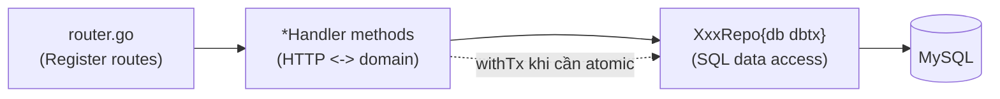

# Architecture Spine — HL Personal Finance — Cải tổ

## Design Paradigm

**Layered-lite, không MVC/hexagonal**: một package Go phẳng (`internal/api`), gồm struct domain (`api.go`), repository (`XxxRepo{db dbtx}` + `NewXxxRepo`), handler (method trên `*Handler`), route (`router.go`). Đây **không phải quyết định mới** — đây là quy ước đã tồn tại và hoạt động tốt trong `internal/api`; spine này ratify (xác nhận) và mở rộng nó cho các năng lực mới, không thay thế bằng kiến trúc phân lớp khác.



## Invariants & Rules

### AD-1 — Giữ nguyên paradigm hiện có cho mọi năng lực mới `[ADOPTED]`

- **Binds:** toàn bộ repo/handler mới (SettingsRepo, FixedCostRepo, IncomeRepo, AlertStateRepo, FlagRepo).
- **Prevents:** một agent/dev sau này đưa layer controller/service riêng (như scaffold thử nghiệm) vào, tạo ra hai phong cách kiến trúc song song trong cùng package.
- **Rule:** mọi repo mới đều là `XxxRepo{db dbtx}` + `NewXxxRepo(db dbtx) *XxxRepo`, method nhận `ctx` + `userID` đầu tiên; mọi handler mới là method trên `*Handler`, đăng ký trong `router.go`, dùng `ok()`/`fail()` cho response.

### AD-2 — Ranh giới phạm vi: bỏ qua "learning scaffold"

- **Binds:** toàn bộ công việc của bản cải tổ này.
- **Prevents:** một dev/agent sau này nhầm `internal/controller`, `internal/services`, `internal/repo`, `internal/routers`, `internal/server`, `internal/database`, `internal/initialize`, `internal/middlewares`, `global/`, `config/*.yaml`, `cmd/api`, `cmd/server`, `cmd/cli` là code cần mở rộng.
- **Rule:** các thư mục/entrypoint trên **không được đọc, không được sửa, không được dùng làm tham chiếu quy ước** cho công việc này — chúng đã bị chính codebase gắn cờ là "half-finished learning scaffold" (comment trong `cmd/web/main.go`, `internal/api/api.go`) và tách biệt hoàn toàn khỏi production (`cmd/web` + `internal/api`).

### AD-3 — Một hàm tính "Chu kỳ ngân sách" duy nhất, hợp đồng khoảng thời gian cố định

- **Binds:** FR-1, FR-4, FR-5, FR-6, FR-7, FR-8, FR-9, FR-10 (mọi năng lực phụ thuộc vào "đang ở chu kỳ nào").
- **Prevents:** Safe-to-spend, cảnh báo ngân sách, và phát hiện bất thường tự tính "chu kỳ hiện tại" theo cách khác nhau; hai story cùng viết lại `CycleWindow` với quy ước `end` inclusive/exclusive khác nhau (lệch 1 ngày ở mỗi lần chuyển chu kỳ).
- **Rule:**
  - Tồn tại đúng một hàm thuần `CycleWindow(cycleStartDay int, asOf time.Time) (start, end time.Time)` trong `cycle.go`. **`end` luôn là exclusive** (`[start, end)`); mọi nơi so sánh dùng `>= start && < end` — không có ngoại lệ, kể cả code hiển thị.
  - Tồn tại thêm `PreviousCycles(cycleStartDay int, asOf time.Time, n int) []CycleWindow` cho FR-8/FR-10 (trung bình N chu kỳ gần nhất) — tính bằng cách lùi từng chu kỳ một (không giả định độ dài chu kỳ cố định, vì các tháng có số ngày khác nhau).
  - `cycle.go` được tạo bởi story hiện thực **FR-1 (Safe-to-spend)** — đây là chủ sở hữu duy nhất; mọi story FR-4 đến FR-10 sau đó chỉ **import**, không viết lại hàm.
  - Thay đổi `user_settings.cycle_start_day` (FR-4) có hiệu lực **ngay lập tức** cho mọi lần gọi `CycleWindow` tiếp theo — đây là đánh đổi có chủ đích: các row `incomes`/`budget_alert_state` đã ghi theo `cycle_start_date` cũ trở thành dữ liệu lịch sử không còn được truy vấn hiện tại trỏ tới (không bị xoá, chỉ không hiển thị). Chấp nhận được vì đây là cấu hình hiếm khi đổi, do chính một người dùng cá nhân tự thao tác — không xây cơ chế "effective-dating" cho v1.

### AD-4 — `budgets.month` không đổi cột; luôn diễn giải theo chu kỳ, không theo đồng hồ hệ thống

- **Binds:** FR-4, FR-5, FR-6, FR-7, và **trang/endpoint Ngân sách hiện có** (không chỉ các endpoint mới).
- **Prevents:** một migration phá vỡ dữ liệu `budgets` hiện có; trang Ngân sách cũ và `/cycle/summary` mới hiển thị hai con số khác nhau cho "đã dùng bao nhiêu kỳ này" một khi `cycle_start_day != 1`.
- **Rule:** cột `budgets.month` (CHAR(7)) **giữ nguyên, không ALTER**. Mọi nơi đọc/ghi `budgets.month` — kể cả trang Ngân sách hiện có, không chỉ endpoint mới — đều diễn giải `month` là **"tháng dương lịch chứa `cycle_start_date` của chu kỳ hiện tại"**, không phải "tháng theo đồng hồ hệ thống". Khi `cycle_start_day = 1` (mặc định), hai cách diễn giải trùng nhau nên hành vi hiện tại không đổi. Khi khác 1, chỉ tồn tại **một** khái niệm "kỳ hiện tại" trong toàn app — không có hai view song song. Mọi tổng hợp giao dịch cho FR-1/5/6/7/8 lọc theo **khoảng ngày** `[cycle_start, cycle_end)` từ AD-3, không bao giờ so khớp chuỗi `month`.

### AD-5 — Trạng thái mới chỉ nằm ở bảng mới, không ALTER bảng cũ `[ADOPTED — theo quy ước migrate hiện có]`

- **Binds:** toàn bộ schema mới của bản cải tổ.
- **Prevents:** rủi ro trên dữ liệu `users`/`categories`/`transactions`/`budgets` hiện có, vì codebase hiện chỉ có `CREATE TABLE IF NOT EXISTS` (không có cơ chế `ALTER TABLE`/migration có version).
- **Rule:** mọi dữ liệu mới (Lương, chi phí cố định, cài đặt chu kỳ, trạng thái cảnh báo, trạng thái gắn cờ) là **bảng mới**, thêm vào cùng danh sách `stmts` trong `Migrate()`, có FK về `users`/`categories`/`transactions` khi cần. Không bao giờ thêm cột vào bốn bảng gốc.

### AD-6 — Bảng trạng thái append-only là nguồn sự thật duy nhất cho "đã cảnh báo/đã xem"

- **Binds:** FR-6, FR-7, FR-9, FR-10.
- **Prevents:** tính lại "đã cảnh báo ngưỡng này chưa" hay "giao dịch này đã xem chưa" từ lịch sử giao dịch thô mỗi lần đọc; sửa/xoá giao dịch âm thầm xoá hoặc hồi sinh một cảnh báo/cờ đã có; cảnh báo chu kỳ trước rò rỉ sang chu kỳ sau; hai nơi (repo mới vs. join trong `TransactionRepo`) tự suy ra ý nghĩa khác nhau cho cùng một trường JSON.
- **Rule:**
  - `budget_alert_state` là **append-only** sau khi ghi, ngoại trừ `dismissed_at`. `UpdateTransaction`/`DeleteTransaction` chạy lại **đúng phép kiểm tra ngưỡng như create**, nhưng **không bao giờ xoá hoặc reset** một row đã tồn tại — tổng giảm xuống dưới ngưỡng đơn giản là không sinh thêm row mới cho ngưỡng đó.
  - `transaction_flags`: phép kiểm tra bất thường chạy trên **Create luôn**; trên **Update chỉ khi chưa có row `transaction_flags` cho giao dịch đó**. Một khi đã có row (dù đã `acknowledged_at` hay chưa), các lần sửa sau **không đánh giá lại** — ngăn một giao dịch đã "đã xem, không vấn đề" bị gắn cờ lại chỉ vì sửa ngày/ghi chú.
  - Đọc "cảnh báo đang hoạt động" (FR-6, FR-7) **bắt buộc** lọc thêm `cycle_start_date = CycleWindow(asOf).start`, ngoài `dismissed_at IS NULL` — cảnh báo không xuyên chu kỳ dù chưa từng bị đóng.
  - Trường JSON `flagged` trên `GET /transactions` = `reason IS NOT NULL`; trạng thái xem là trường **riêng** `flagAcknowledged` = `acknowledged_at IS NOT NULL`. Không bao giờ suy ra trường này từ trường kia.
  - Chỉ `FlagRepo` được viết SQL trực tiếp lên `transaction_flags` — kể cả JOIN mà `TransactionRepo` cần để tránh N+1 (qua một method dùng chung của `FlagRepo`, không copy SQL sang `TransactionRepo`).

### AD-7 — Compute-on-write: cùng một DB transaction, tối đa một row mới mỗi lần, an toàn khi trùng lặp

- **Binds:** FR-5, FR-8.
- **Prevents:** một crash giữa lúc commit giao dịch và lúc ghi cảnh báo làm mất cảnh báo vĩnh viễn; một lần chi tiêu vượt nhiều ngưỡng cùng lúc tạo ra số row/banner không xác định; hai request đồng thời cùng ghi một ngưỡng gây lỗi 500 do trùng khoá UNIQUE; gắn cờ hồi tố nhầm giao dịch.
- **Rule:**
  - Các ghi phụ trợ (`budget_alert_state`, `transaction_flags`) **phải nằm trong cùng một `h.withTx`** với `INSERT/UPDATE/DELETE` trên `transactions` — "ngay sau khi commit" nghĩa là **thứ tự logic bên trong cùng một DB transaction**, không phải một round-trip DB riêng sau khi đã commit.
  - Một lần compute-on-write chỉ chèn **tối đa một** row `budget_alert_state` mới mỗi danh mục — ngưỡng **cao nhất** mới vượt qua trong lần ghi đó, kể cả khi một giao dịch lớn vượt qua 70/90/100% cùng lúc.
  - Ghi vào `budget_alert_state`/`transaction_flags` dùng `INSERT IGNORE` hoặc `ON DUPLICATE KEY UPDATE` — trùng khoá UNIQUE được coi là thành công (đã kích hoạt), không phải lỗi.
  - Gắn cờ bất thường gắn vào **đúng giao dịch** khiến tổng chi tích luỹ của danh mục trong chu kỳ **lần đầu tiên** vượt ngưỡng — các giao dịch nhỏ trước đó không bị gắn cờ hồi tố.

### AD-8 — Ranh giới tính-một-lần giữa Backend và Frontend, có hợp đồng dữ liệu cố định

- **Binds:** FR-1, FR-5, FR-6, FR-7, FR-8 (mọi con số/nhãn hiển thị dựa trên ngưỡng).
- **Prevents:** `frontend/src/lib/analytics.ts` tính lại % ngân sách/ngưỡng bất thường độc lập với backend; trang Ngân sách hiện có và `/cycle/summary` mới tính hai kết quả khác nhau; backend và frontend chọn hai kiểu mã hoá enum/số âm khác nhau cho cùng một trường.
- **Rule:**
  - Safe-to-spend, trạng thái 3 mức ngân sách, danh sách cảnh báo đang hoạt động, và cờ bất thường được **tính một lần ở backend**, trả qua API. `analytics.ts` hiện có tiếp tục sở hữu các phép biến đổi thuần hiển thị (định dạng biểu đồ, xu hướng 6 tháng) — không tính lại bất kỳ ngưỡng nào thuộc bản cải tổ này.
  - **`GET /budgets` (endpoint hiện có) được mở rộng** thêm `spent`, `percent`, `status` mỗi row, tính bằng **đúng cùng hàm** trong `cycle.go` mà `/cycle/summary` dùng — trang Ngân sách hiện có tiêu thụ trường này thay vì tự tính, đóng khả năng hai nơi lệch nhau.
  - Hợp đồng dữ liệu `GET /cycle/summary` (JSON, dưới `data`):
    ```json
    {
      "safeToSpend": -125000,
      "daysRemaining": 6,
      "income": null,
      "previousIncome": 18000000,
      "budgets": [
        { "categoryId": "…", "spent": 3120000, "limit": 3000000, "percent": 104, "status": "over" }
      ],
      "activeAlerts": [
        { "categoryId": "…", "threshold": 90, "status": "near" }
      ]
    }
    ```
    `safeToSpend` là số nguyên có dấu (VND) — **âm nghĩa là đã chi vượt**, không bao giờ được clamp về 0. `income`/`previousIncome` là `int64` hoặc `null` (`null` = chưa khai báo cho chu kỳ này, khác `0` = đã khai báo bằng 0). `status` luôn là chuỗi tiếng Anh viết thường `"within" | "near" | "over"` — đúng từ vựng component đã đặt trong `EXPERIENCE.md`, không dùng số hay tiếng Việt.

## Consistency Conventions

| Concern | Convention |
| --- | --- |
| Naming (entities, files) | Bảng mới: `user_settings`, `fixed_costs`, `incomes`, `budget_alert_state`, `transaction_flags` (snake_case, số nhiều trừ `user_settings` — 1:1 với user). File repo mới: `repo_settings.go`, `repo_fixed_cost.go`, `repo_income.go`, `repo_alert_state.go`, `repo_flag.go`, cộng `cycle.go` (hàm thuần `CycleWindow`/`PreviousCycles`, không phải repo). Handler mới: `fixed_costs.go`, `cycle_settings.go` (gộp Lương + cài đặt, xem AD dưới), `cycle_summary.go`. |
| Data & formats (ids, dates, envelope) | Id: UUID string CHAR(36) (kế thừa `google/uuid`). Tiền: BIGINT (đơn vị VND nguyên, không phần thập phân — kế thừa quy ước `amount`/`limit_amount` hiện có), **không bao giờ clamp số âm về 0** khi số âm có ý nghĩa (xem AD-8). Ngày: `DATE` SQL / `"2006-01-02"` Go / `"yyyy-mm-dd"` JSON (kế thừa `dateLayout`). Envelope response: `{code, message, data}` qua `ok()`/`fail()` — không dùng `internal/pkg/response` (xem Deferred). |
| State & cross-cutting (mutation, auth) | Mọi bảng mới có `user_id` + scoping theo `userIDFrom(c)` giống các repo hiện có — không có endpoint mới nào trả dữ liệu không lọc theo user. `PUT /cycle-settings` gộp ghi Lương (bảng `incomes`) và cài đặt (bảng `user_settings`) trong **một** `h.withTx`, khớp với hành động "Lưu" duy nhất của `cycle-update-sheet` (UX) — `fixed_costs` vẫn là CRUD riêng, không nằm trong giao dịch này. Insert vào bảng trạng thái (`budget_alert_state`, `transaction_flags`) dùng `INSERT IGNORE`/`ON DUPLICATE KEY UPDATE`, không bao giờ để lỗi trùng khoá UNIQUE lộ ra ngoài thành lỗi 500. |

## Stack

*(SEED — xác nhận đúng theo `go.mod` tại thời điểm viết, đã web-check ngày 2026-09-12; không thêm dependency mới cho bản cải tổ này — `database/sql` + driver hiện có là đủ.)*

| Name | Version | Ghi chú |
| --- | --- | --- |
| Go | 1.26.3 | Đã có bản vá bảo mật mới hơn (1.26.4, ~2026-06) — cân nhắc bump khi thuận tiện, không phải quyết định kiến trúc. |
| gin-gonic/gin | v1.12.0 | Mới nhất tại thời điểm viết. |
| gin-contrib/cors | v1.7.7 | Có bản mới hơn (v1.7.8) — bump thường lệ. |
| go-sql-driver/mysql | v1.10.0 | Có bản mới hơn (v1.10.1) — bump thường lệ. |
| golang-jwt/jwt/v5 | v5.3.1 | Mới nhất. |
| google/uuid | v1.6.0 | Mới nhất. |
| golang.org/x/crypto | v0.53.0 | Có bản mới hơn (v0.57.0) — bump thường lệ, không khẩn cấp cho scope này. |
| MySQL | 8 (kế thừa, không đổi) | Hỗ trợ UNIQUE nhiều cột tới 16 cột — đủ cho các bảng mới. |
| React / TypeScript / Vite / Tailwind | 19 / 5 / 6 / v4 (kế thừa, không đổi) | |

## Structural Seed

### Bảng mới (ERD delta — chỉ thêm, không đổi 4 bảng gốc)

```mermaid
erDiagram
  users ||--o| user_settings : "1:1"
  users ||--o{ fixed_costs : "has"
  users ||--o{ incomes : "has (per cycle)"
  users ||--o{ budget_alert_state : "has"
  categories ||--o{ budget_alert_state : "scoped by"
  transactions ||--o| transaction_flags : "0..1"

  user_settings {
    char36 user_id PK_FK
    tinyint cycle_start_day "default 1"
    bigint savings_goal "default 0"
  }
  fixed_costs {
    char36 id PK
    char36 user_id FK
    varchar name
    bigint amount
  }
  incomes {
    char36 id PK
    char36 user_id FK
    date cycle_start_date
    bigint amount
  }
  budget_alert_state {
    char36 id PK
    char36 user_id FK
    char36 category_id FK
    date cycle_start_date
    tinyint threshold "70/90/100"
    datetime triggered_at
    datetime dismissed_at "nullable"
  }
  transaction_flags {
    char36 transaction_id PK_FK
    varchar reason
    datetime flagged_at
    datetime acknowledged_at "nullable"
  }
```

- `incomes`: `UNIQUE(user_id, cycle_start_date)` — upsert giống `BudgetRepo.Upsert` hiện có (FR-2).
- `budget_alert_state`: `UNIQUE(user_id, category_id, cycle_start_date, threshold)` — append-only, ghi qua `INSERT IGNORE` (AD-6, AD-7).
- `transaction_flags`: PK = `transaction_id`, FK `ON DELETE CASCADE` về `transactions` (FR-8, FR-9). **[CẮT KHỎI V1 — 2026-09-13]** Epic 3/FR-8/FR-9/FR-10 bị cắt khỏi kế hoạch; bảng này chưa từng được tạo và sẽ không được triển khai. Xem `sprint-change-proposal-2026-09-13.md`.

### Cây thư mục (chỉ phần thêm mới)

```text
internal/api/
  cycle.go             # CycleWindow()/PreviousCycles() thuần + SafeToSpend()/BudgetStatus() (AD-3, AD-8)
  repo_settings.go      # SettingsRepo — user_settings
  repo_fixed_cost.go    # FixedCostRepo — fixed_costs
  repo_income.go        # IncomeRepo — incomes
  repo_alert_state.go   # AlertStateRepo — budget_alert_state
  repo_flag.go          # FlagRepo — transaction_flags (chủ sở hữu duy nhất, xem AD-6)
  fixed_costs.go         # handlers: CRUD /fixed-costs
  cycle_settings.go     # handler: PUT /cycle-settings (Lương + savings_goal + cycle_start_day, 1 withTx)
  cycle_summary.go      # handler: GET /cycle/summary (FR-1, FR-6, FR-7)
```

## Capability → Architecture Map

| Capability / FR | Lives in | Governed by |
| --- | --- | --- |
| FR-1 Hiển thị Safe-to-spend | `GET /cycle/summary` → `cycle.go` | AD-3, AD-8 |
| FR-2 Khai báo Lương | `PUT /cycle-settings` (phần Lương) → `IncomeRepo`; gợi ý điền sẵn qua `previousIncome` | AD-3, AD-5, AD-8 |
| FR-3 Chi phí cố định + Mục tiêu tiết kiệm | `/fixed-costs` (CRUD) → `FixedCostRepo`; `savings_goal` qua `PUT /cycle-settings` → `SettingsRepo` | AD-5 |
| FR-4 Cấu hình ngày bắt đầu chu kỳ | `cycle_start_day` qua `PUT /cycle-settings` → `SettingsRepo` + `cycle.go` | AD-3, AD-4, AD-5 |
| FR-5, FR-6 Cảnh báo ngân sách chủ động | Compute-on-write trong `CreateTransaction`/`UpdateTransaction`/`DeleteTransaction` (cùng `withTx`) → `AlertStateRepo`; đọc qua `GET /cycle/summary.activeAlerts`; đóng qua `POST /alerts/:categoryId/:threshold/dismiss` | AD-4, AD-6, AD-7 |
| FR-7 Tổng quan trạng thái ngân sách | `GET /cycle/summary.budgets` **và** `GET /budgets` (mở rộng, cùng hàm tính) | AD-4, AD-8 |
| ~~FR-8, FR-9 Gắn cờ bất thường~~ [CẮT KHỎI V1] | ~~Compute-on-write (chỉ trên Create, hoặc Update khi chưa có flag) → `FlagRepo`; trường `flagged`/`flagAcknowledged` trên `GET /transactions`; xác nhận qua `POST /transactions/:id/ack-flag`~~ | AD-6, AD-7 |
| ~~FR-10 Không gắn cờ khi thiếu dữ liệu nền~~ [CẮT KHỎI V1] | `cycle.go` đã có sẵn `PreviousCycles()` làm hạ tầng dùng chung, nhưng nay không còn nơi nào gọi — dead code vô hại, có thể dọn sau, không khẩn cấp | AD-3 |

## Deferred

- **Snapshot chi phí cố định theo chu kỳ**: hiện để `fixed_costs` là danh sách sống (sửa lúc nào cũng áp dụng ngay, kể cả cho ngày đã qua trong chu kỳ hiện tại). Nếu sau này thấy gây nhầm lẫn, cân nhắc snapshot theo chu kỳ — chưa cần cho v1.
- **Effective-dating cho `cycle_start_day`**: đã cân nhắc (xem AD-3) và **chủ động chọn không xây** — thay đổi có hiệu lực ngay, chấp nhận một số row lịch sử không còn được trỏ tới. Nếu sau này việc này gây khó chịu thực sự khi dùng, quay lại cân nhắc effective-dating.
- **Cơ chế migration có version**: chưa cần — mọi thay đổi của bản cải tổ này đều là bảng mới, tương thích với cách `CREATE TABLE IF NOT EXISTS` hiện có. Nếu tương lai cần sửa đổi một bảng đã tồn tại (ALTER), đó là lúc phải giới thiệu cơ chế migration thật (ví dụ `golang-migrate`) — không phải bây giờ.
- **Hợp nhất envelope response trùng lặp** (`internal/pkg/response` vs `ok()`/`fail()` trong `internal/api`): trùng lặp vô hại, chỉ một call site (`/health`) dùng bản pkg. Dọn dẹp khi thuận tiện, không phải việc của bản cải tổ này.
- **Dọn "learning scaffold"** (`internal/controller`, `internal/services`, v.v. — xem AD-2): việc xoá các thư mục này là dọn dẹp repo, không phải phạm vi kiến trúc của bản cải tổ — đề xuất làm riêng, không trộn vào các epic/story của bản cải tổ.
- **Bump dependency thường lệ** (Go 1.26.4, gin-contrib/cors v1.7.8, go-sql-driver/mysql v1.10.1, x/crypto v0.57.0): không khẩn cấp cho scope này, không phải quyết định kiến trúc — làm khi thuận tiện, ngoài phạm vi các epic/story của bản cải tổ.
- **Hạ tầng triển khai**: không đổi — vẫn Docker/Docker Compose, self-host/free-tier như hiện tại (đúng Non-Goal "Cost" của PRD §7). Bảng mới được tạo tự động qua `Migrate()` hiện có ở lần khởi động kế tiếp — không cần bước deploy riêng, không cần thay đổi `Dockerfile`/`docker-compose.yml`/biến môi trường.
- **Sổ chung gia đình (Giai đoạn 2)**: mô hình `user_id`-scoped ở mọi bảng mới cố tình đơn giản cho v1 solo-user; khi làm Giai đoạn 2, các bảng này sẽ cần thêm khái niệm "group" — không thiết kế trước cho nhóm ở bản cải tổ này (đúng theo PRD/addendum của brief).
